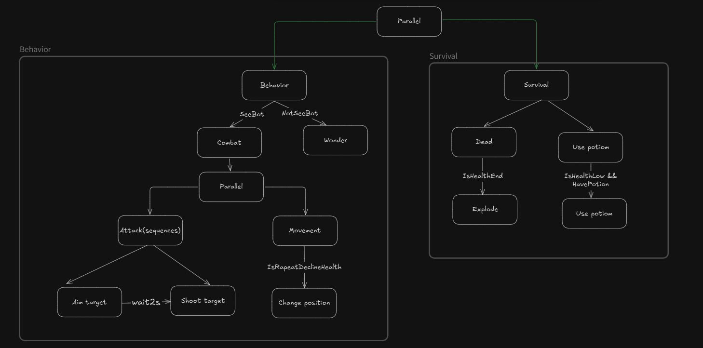
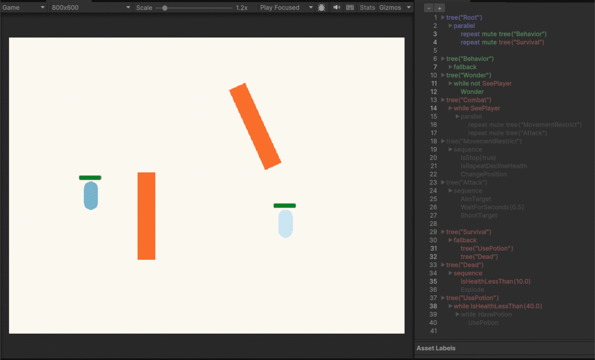

# BattleBotsAI

## Overview  
**BattleBotsAI** is a Unity project that demonstrates the use of **Behavior Trees** to control AI for two bots engaged in a dynamic battle. The project leverages the **Panda.BT** plugin for Behavior Tree implementation, showcasing how this system simplifies AI decision-making through modular and reusable structures.

The project features:
- Bots making decisions based on their environment (e.g., attacking or repositioning).
- Health-based survival logic (using potions or self-destructing).
- A simple yet expandable setup using Behavior Trees.

---

## What Are Behavior Trees?  
### **Definition**  
A Behavior Tree (BT) is a hierarchical structure used to model decision-making processes in AI. It consists of nodes representing tasks or conditions. These nodes are organized into sequences, fallbacks, and parallel executions, enabling flexible and modular AI design.

### **Benefits of Behavior Trees**  
- **Modularity**: Tasks can be created and reused easily.  
- **Scalability**: Complex behaviors can be broken into simpler components.  
- **Debugging**: Each node's status is easy to visualize, making debugging straightforward.  
- **Flexibility**: Behavior can adapt dynamically to the game state.

### **How Behavior Trees Work**  
- **Nodes**: The fundamental building blocks (actions or conditions).  
- **Control Flow**: The tree traverses nodes based on logic (e.g., sequences or fallback).  
- **Execution**: Each node returns a status (`Success`, `Failure`, or `Running`), dictating the flow of execution.

---

## How to Implement Behavior Trees in Unity with Panda.BT  
**Panda.BT** is a Unity asset for implementing Behavior Trees directly through scripts or visual representation. It provides a simple syntax for defining trees and tasks.  

### **Key Components of Panda.BT**  
1. **Sequence**:  
   - Executes tasks in order.  
   - If one task fails, the sequence fails.  
   - Example: Aim → Wait → Shoot.  

2. **Fallback**:  
   - Executes tasks in order until one succeeds.  
   - Useful for "plan B" logic.  
   - Example: Attack → Reposition.  

3. **Parallel**:  
   - Executes multiple tasks simultaneously.  
   - Tasks can succeed or fail independently.  
   - Example: Move while Checking for Enemies.

4. **Tasks**:  
   - Custom logic is implemented within nodes (e.g., shooting, moving, checking conditions).

For more details, refer to the [Panda.BT Documentation](http://www.pandabehaviour.com/documentation).

---

## How This Project Works  

### **Behavior Trees in This Project**

The project uses two main trees:
1. **Behavior**:  
   - Handles combat and movement decisions.  
   - Subtrees:  
     - **Combat**: Attack and reposition logic when the bot sees an enemy.  
     - **Wonder**: Random movement when no enemy is detected.  

2. **Survival**:  
   - Manages health-based decisions.  
   - Subtrees:  
     - **Use Potion**: Restores health when low.  
     - **Dead**: Explodes when health is critically low.

### **Key Scripts and Logic**  
1. **Combat Logic**:  
   - The bot aims at the target, waits, and shoots in a sequence.  
   - If health declines repeatedly, the bot changes position.

2. **Survival Logic**:  
   - If health is below 40% and a potion is available, it uses a potion.  
   - If health reaches 0, the bot self-destructs.  

---

## How to Run the Project  
1. Clone the repository:  
   ```bash
   git clone https://github.com/mryusefi/BattleBotsAI
2. Open the project in Unity (tested on Unity version XX).
3. Play the scene to see the bots in action.
   
---

## Demo 


The above GIF shows the bots dynamically engaging in combat and survival tasks.
   
---

## Contribution
Feel free to fork the repository, open issues, or submit pull requests for improvements or additional features. 
   


Let me know if you'd like to refine any section or add more details! 😊
